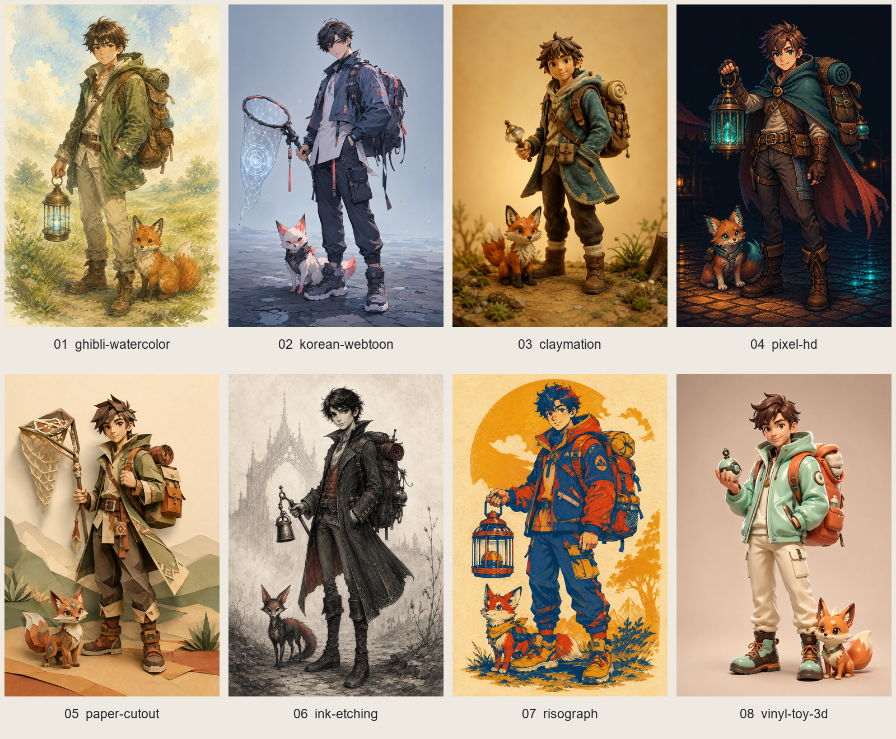

# Main-character key-visual candidates

Generated with the built-in image generation tool. All eight original PNGs are 1024 ? 1536; each was verified to exceed 50 KB. Contact sheet: four columns ? two rows, numbered left to right.



## 01 ? ghibli-watercolor

File: [01_ghibli-watercolor.png](01_ghibli-watercolor.png)

Exact final prompt:

```text
Use case: stylized-concept. Create one main-character key visual for a mobile monster-taming idle game. Portrait 1024x1536, full body with both feet and all equipment within frame, standing three-quarter view, looking at the viewer, confident but friendly. Exactly one young adult monster tamer age 18, carrying a capture tool and a clearly visible travel backpack, with exactly one small fox-like companion beside their feet. Youthful adventure clothing, fully clothed. Simple background or subtle environment hint. No text, letters, logos, signatures, watermarks, panels, extra characters or extra creatures. Not generic chibi or mobile-gacha art. Soft watercolor illustration with hand-painted textures, natural earthy palette, Studio Ghibli / Ni no Kuni warmth. Tamer wears a moss-green travel jacket, linen trousers and worn leather boots, holds a lantern-cage; russet fox companion. Gentle meadow hint, warm diffuse daylight, visible watercolor blooms and paper grain, graceful natural human proportions.
```

Asset direction: Monsters, environments and UI illustrations would use earthy watercolor washes, soft contours and visible paper grain.

## 02 ? korean-webtoon

File: [02_korean-webtoon.png](02_korean-webtoon.png)

Exact final prompt:

```text
Use case: stylized-concept. Create one main-character key visual for a mobile monster-taming idle game. Portrait 1024x1536, full body with both feet and all equipment within frame, standing three-quarter view, looking at the viewer, confident but friendly. Exactly one young adult monster tamer age 18, carrying a capture tool and a clearly visible travel backpack, with exactly one small fox-like companion beside their feet. Youthful adventure clothing, fully clothed. Simple background or subtle environment hint. No text, letters, logos, signatures, watermarks, panels, extra characters or extra creatures. Not generic chibi or mobile-gacha art. Clean semi-realistic Korean webtoon lines, fashionable modern-fantasy layered streetwear outfit, flat cel shading with sharp highlights. Tamer wears a cropped technical jacket over a long shirt, tapered cargo trousers and boots, holds a rune net with abstract non-letter magical geometry; fox companion. Subtle urban-fantasy pavement hint, cool blue-gray palette with vivid coral accents, poised friendly gaze, long natural human proportions.
```

Asset direction: Monsters, environments and UI portraits would share crisp webtoon linework, flat cel shadows and sharp coral highlights.

## 03 ? claymation

File: [03_claymation.png](03_claymation.png)

Exact final prompt:

```text
Use case: stylized-concept. Create one main-character key visual for a mobile monster-taming idle game. Portrait 1024x1536, full body with both feet and all equipment within frame, standing three-quarter view, looking at the viewer, confident but friendly. Exactly one young adult monster tamer age 18, carrying a capture tool and a clearly visible travel backpack, with exactly one small fox-like companion beside their feet. Youthful adventure clothing, fully clothed. Simple background or subtle environment hint. No text, letters, logos, signatures, watermarks, panels, extra characters or extra creatures. Not generic chibi or mobile-gacha art. Stop-motion clay figure photograph, visible fingerprints in hand-sculpted clay, felt and woven fabric textures in travel coat and backpack, miniature-set lighting. Tamer holds a small capture bell; fox companion sculpted from clay. Simple miniature woodland ground on seamless warm background, soft amber practical light, charming handmade imperfections, slender adolescent proportions, head about one sixth of height, not chibi.
```

Asset direction: Monsters, props and environments would be handcrafted clay miniatures with felt details, tactile imperfections and warm set lighting.

## 04 ? pixel-hd

File: [04_pixel-hd.png](04_pixel-hd.png)

Exact final prompt:

```text
Use case: stylized-concept. Create one main-character key visual for a mobile monster-taming idle game. Portrait 1024x1536, full body with both feet and all equipment within frame, standing three-quarter view, looking at the viewer, confident but friendly. Exactly one young adult monster tamer age 18, carrying a capture tool and a clearly visible travel backpack, with exactly one small fox-like companion beside their feet. Youthful adventure clothing, fully clothed. Simple background or subtle environment hint. No text, letters, logos, signatures, watermarks, panels, extra characters or extra creatures. Not generic chibi or mobile-gacha art. HD pixel art at Octopath Traveler / Sea of Stars quality, entirely crisp square pixels, 3-4 px outlines, rich deliberate dithering and sophisticated pixel clusters. Tamer in a traveling cape and fitted adventure trousers holds a glowing lantern-cage; fox companion. Restrained night-market lighting hint with amber and teal light pools, no people or lettering, dark simplified background. Natural elongated human proportions, no smooth painted edges or vector curves.
```

Asset direction: Monsters, environments and effects would use consistent pixel clusters, 3?4 px outlines, rich dithering and amber?teal night lighting.

## 05 ? paper-cutout

File: [05_paper-cutout.png](05_paper-cutout.png)

Exact final prompt:

```text
Use case: stylized-concept. Create one main-character key visual for a mobile monster-taming idle game. Portrait 1024x1536, full body with both feet and all equipment within frame, standing three-quarter view, looking at the viewer, confident but friendly. Exactly one young adult monster tamer age 18, carrying a capture tool and a clearly visible travel backpack, with exactly one small fox-like companion beside their feet. Youthful adventure clothing, fully clothed. Simple background or subtle environment hint. No text, letters, logos, signatures, watermarks, panels, extra characters or extra creatures. Not generic chibi or mobile-gacha art. Layered paper cut-out diorama, clearly visible cut paper edges and physical drop shadows, limited flat ochre, sage, rust and cream colors, tactile storybook feel. Tamer wears a folded-paper travel coat and trousers, holds a rune net with abstract geometric non-letter motifs; fox companion cut from stacked paper. Sparse layered hillside backdrop, soft raking light revealing depth, elegant long human proportions.
```

Asset direction: Monsters, scenery and interface ornaments would use stacked cut-paper shapes, a limited earthy palette and consistent physical shadows.

## 06 ? ink-etching

File: [06_ink-etching.png](06_ink-etching.png)

Exact final prompt:

```text
Use case: stylized-concept. Create one main-character key visual for a mobile monster-taming idle game. Portrait 1024x1536, full body with both feet and all equipment within frame, standing three-quarter view, looking at the viewer, confident but friendly. Exactly one young adult monster tamer age 18, carrying a capture tool and a clearly visible travel backpack, with exactly one small fox-like companion beside their feet. Youthful adventure clothing, fully clothed. Simple background or subtle environment hint. No text, letters, logos, signatures, watermarks, panels, extra characters or extra creatures. Not generic chibi or mobile-gacha art. Muted ink and fine etching, gothic-whimsical mood reminiscent of Hollow Knight / Tim Burton, elegant rather than cute. Slim young tamer with long natural limbs, tailored traveling coat, boots and backpack holds a capture bell; narrow fox-like companion. Bone paper and charcoal ink with only one accent color: muted vermilion. Fine crosshatching, engraved linework, sparse misty arch silhouette, restrained warm friendly expression, no oversized chibi head.
```

Asset direction: Monsters, environments and interface ornaments would use elegant etched linework, charcoal crosshatching and restrained vermilion accents.

## 07 ? risograph

File: [07_risograph.png](07_risograph.png)

Exact final prompt:

```text
Use case: stylized-concept. Create one main-character key visual for a mobile monster-taming idle game. Portrait 1024x1536, full body with both feet and all equipment within frame, standing three-quarter view, looking at the viewer, confident but friendly. Exactly one young adult monster tamer age 18, carrying a capture tool and a clearly visible travel backpack, with exactly one small fox-like companion beside their feet. Youthful adventure clothing, fully clothed. Simple background or subtle environment hint. No text, letters, logos, signatures, watermarks, panels, extra characters or extra creatures. Not generic chibi or mobile-gacha art. Three-color risograph / silkscreen print using only indigo, vermilion and mustard inks over warm unprinted paper, halftone grain, slight color misregistration, bold poster composition without any typography. Tamer in graphic travel jacket and trousers holds a lantern-cage; fox companion. Strong full-body silhouette, natural human proportions, large simple background color shapes, tactile ink overlap and confident friendly expression.
```

Asset direction: Monsters, scenery and interface illustrations would share three-ink separations, halftone textures and slight registration offsets.

## 08 ? vinyl-toy-3d

File: [08_vinyl-toy-3d.png](08_vinyl-toy-3d.png)

Exact final prompt:

```text
Use case: stylized-concept. Create one main-character key visual for a mobile monster-taming idle game. Portrait 1024x1536, full body with both feet and all equipment within frame, standing three-quarter view, looking at the viewer, confident but friendly. Exactly one young adult monster tamer age 18, carrying a capture tool and a clearly visible travel backpack, with exactly one small fox-like companion beside their feet. Youthful adventure clothing, fully clothed. Simple background or subtle environment hint. No text, letters, logos, signatures, watermarks, panels, extra characters or extra creatures. Not generic chibi or mobile-gacha art. Glossy designer vinyl toy 3D render, soft studio lighting, rounded stylization but NOT chibi proportions: head approximately one fifth of total body height, long torso and legs. Tamer wears a sculpted mint travel jacket, cream trousers, sturdy boots and orange travel backpack, holds a rounded capture bell; small glossy fox companion. Warm neutral seamless studio backdrop, polished vinyl highlights, subtle molded seams, sophisticated collectible art-toy finish.
```

Asset direction: Monsters, props and environments would use glossy molded vinyl materials, rounded forms and soft studio lighting.
