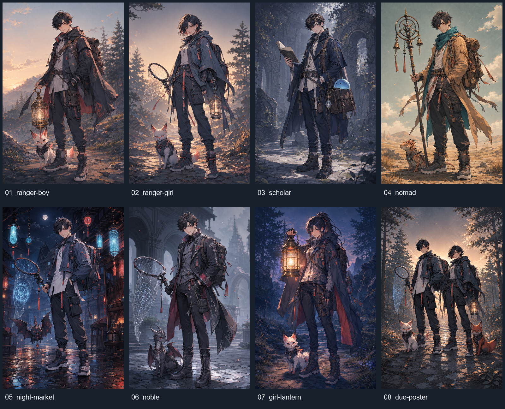

# Main-character key visual — Round 2

Generated using the built-in image generation tool; no APIs, packages, or model CLI were used. Pillow was used only to assemble the labeled contact sheet.

Style authority: ../02_korean-webtoon.png. All eight final images were visually reviewed against its fine semi-realistic Korean webtoon linework, angular cel shading, restrained faces, and natural proportions. No chibi, painterly character rendering, or anime-moe variants were accepted. Nomad palette and duo framing received targeted revisions.

All character images: 1024 × 1536 PNG, verified > 50 KB. Contact sheet: four columns × two rows, numbered left to right.



## 01 — ranger-boy

File: [01_ranger-boy.png](01_ranger-boy.png)

Reference: ../02_korean-webtoon.png.

Exact generation prompt:

```text
Use case: stylized-concept. Create ONE portrait 1024x1536 main-character key visual, a controlled variation of the supplied 02_korean-webtoon reference. Reference role: authoritative rendering style, facial sophistication, proportions and costume construction. Preserve its clean semi-realistic Korean webtoon fine linework, flat angular cel shadow shapes and sharp specular highlights, polished fashionable layered tailoring, realistic slender anatomy with head approximately 1/6.5 total height, restrained eyes and poised friendly expression. Full body including both boots and all equipment with breathing room, three-quarter standing pose, looking at viewer. Young adult monster tamer age 18-22, fully clothed, travel equipment and small companion clearly visible. Fantasy adventure rather than contemporary city civilian. Background subdued so character dominates. No text, letters, logos, watermark, signature, panels. Avoid chibi, oversized head or eyes, anime-moe, painterly brushwork, watercolor, 3D, photorealism. Keep 02's tousled black-haired boy and white coral-tipped fox beside his boots. Replace outfit with layered fantasy ranger gear: leather harness straps and hooded cloak over a modern-cut slate jacket, long pale undershirt, tapered cargo trousers, adventure boots and travel backpack. Replace rune-net with a glowing brass lantern-cage held at his side, magical non-letter geometry. Keep slate blue and coral details. Sparse forest-edge background at golden hour.
```

## 02 — ranger-girl

File: [02_ranger-girl.png](02_ranger-girl.png)

Reference: ../02_korean-webtoon.png.

Exact generation prompt:

```text
Use case: stylized-concept. Create ONE portrait 1024x1536 main-character key visual, a controlled variation of the supplied 02_korean-webtoon reference. Reference role: authoritative rendering style, facial sophistication, proportions and costume construction. Preserve its clean semi-realistic Korean webtoon fine linework, flat angular cel shadow shapes and sharp specular highlights, polished fashionable layered tailoring, realistic slender anatomy with head approximately 1/6.5 total height, restrained eyes and poised friendly expression. Full body including both boots and all equipment with breathing room, three-quarter standing pose, looking at viewer. Young adult monster tamer age 18-22, fully clothed, travel equipment and small companion clearly visible. Fantasy adventure rather than contemporary city civilian. Background subdued so character dominates. No text, letters, logos, watermark, signature, panels. Avoid chibi, oversized head or eyes, anime-moe, painterly brushwork, watercolor, 3D, photorealism. Female counterpart of the reference boy, short practical tousled dark hair, mature understated face, natural proportions. Same ranger gear language: leather harness straps, hooded cloak over modern-cut slate jacket, pale undershirt, tapered cargo trousers, adventure boots, backpack; glowing brass lantern-cage at her side. Slate blue and restrained coral details. White coral-tipped fox-like monster beside her boots. Sparse forest edge at golden hour. Practical fashionable adventurer, no skirt or sexualization.
```

## 03 — scholar

File: [03_scholar.png](03_scholar.png)

Reference: ../02_korean-webtoon.png.

Exact generation prompt:

```text
Use case: stylized-concept. Create ONE portrait 1024x1536 main-character key visual, a controlled variation of the supplied 02_korean-webtoon reference. Reference role: authoritative rendering style, facial sophistication, proportions and costume construction. Preserve its clean semi-realistic Korean webtoon fine linework, flat angular cel shadow shapes and sharp specular highlights, polished fashionable layered tailoring, realistic slender anatomy with head approximately 1/6.5 total height, restrained eyes and poised friendly expression. Full body including both boots and all equipment with breathing room, three-quarter standing pose, looking at viewer. Young adult monster tamer age 18-22, fully clothed, travel equipment and small companion clearly visible. Fantasy adventure rather than contemporary city civilian. Background subdued so character dominates. No text, letters, logos, watermark, signature, panels. Avoid chibi, oversized head or eyes, anime-moe, painterly brushwork, watercolor, 3D, photorealism. Keep reference boy's face and tousled black hair. Bookish fantasy field tamer with tailored layered traveling jacket and fitted trousers, boots, substantial leather satchel instead of technical backpack, brass monocle-goggles pushed on forehead, field notebook held open with blank parchment pages. Compact magical capture charm attached to satchel. Ink-blue and parchment palette, brass details. Exactly one small translucent slime perched visibly on satchel, no fox or other creature. Subtle ancient woodland archive ruin background.
```

## 04 — nomad

File: [04_nomad.png](04_nomad.png)

Reference: ../02_korean-webtoon.png.

Exact generation prompt:

```text
Use case: stylized-concept. Create ONE portrait 1024x1536 main-character key visual, a controlled variation of the supplied 02_korean-webtoon reference. Reference role: authoritative rendering style, facial sophistication, proportions and costume construction. Preserve its clean semi-realistic Korean webtoon fine linework, flat angular cel shadow shapes and sharp specular highlights, polished fashionable layered tailoring, realistic slender anatomy with head approximately 1/6.5 total height, restrained eyes and poised friendly expression. Full body including both boots and all equipment with breathing room, three-quarter standing pose, looking at viewer. Young adult monster tamer age 18-22, fully clothed, travel equipment and small companion clearly visible. Fantasy adventure rather than contemporary city civilian. Background subdued so character dominates. No text, letters, logos, watermark, signature, panels. Avoid chibi, oversized head or eyes, anime-moe, painterly brushwork, watercolor, 3D, photorealism. Keep reference boy's face and tousled dark hair. Desert/steppe wandering monster tamer, wind-folded scarf and long tailored adventure coat over fitted layers, leather straps and traveling pack, tapered trousers and practical boots. Holds bell-staff capture tool with brass bells and abstract non-letter magical geometry. Warm ochre and teal palette. One small lizard-like monster beside his boots. Sparse desert-steppe grasses, weathered stones and distant dunes. Preserve reference's fashionable silhouette and sharp cel treatment.
```

Exact final revision prompt (applied to this variant's initial generated image):

```text
Edit the supplied nomad key visual. Preserve EXACTLY the current fine semi-realistic Korean webtoon rendering, face, natural full-body proportions, pose, bell staff, lizard companion, backpack, environment and composition. Change only costume palette: make the long outer coat clearly warm ochre tan, and the wrapped scarf a rich saturated teal with a matching teal coat lining. Keep trousers dark slate, brass hardware and restrained coral details. Flat angular cel shading and sharp highlights as in reference, no painterly treatment, no chibi or anime-moe. Portrait 1024x1536, no text/logo/watermark.
```

## 05 — night-market

File: [05_night-market.png](05_night-market.png)

Reference: ../02_korean-webtoon.png.

Exact generation prompt:

```text
Use case: stylized-concept. Create ONE portrait 1024x1536 main-character key visual, a controlled variation of the supplied 02_korean-webtoon reference. Reference role: authoritative rendering style, facial sophistication, proportions and costume construction. Preserve its clean semi-realistic Korean webtoon fine linework, flat angular cel shadow shapes and sharp specular highlights, polished fashionable layered tailoring, realistic slender anatomy with head approximately 1/6.5 total height, restrained eyes and poised friendly expression. Full body including both boots and all equipment with breathing room, three-quarter standing pose, looking at viewer. Young adult monster tamer age 18-22, fully clothed, travel equipment and small companion clearly visible. Fantasy adventure rather than contemporary city civilian. Background subdued so character dominates. No text, letters, logos, watermark, signature, panels. Avoid chibi, oversized head or eyes, anime-moe, painterly brushwork, watercolor, 3D, photorealism. Closest to original 02: same black-haired boy, cropped technical jacket over long pale shirt, tapered cargo trousers, boots, backpack, cool slate and coral accents, glowing rune-net with abstract non-letter geometry. Streetwear meets fantasy through leather talisman straps, small alchemical vials and enchanted net fittings. One small bat-like monster hovering beside him at knee level, wings fully visible; no fox. Fantasy night-market hinted with hanging neon cyan and coral magical lanterns, old timber stalls and wet cobblestone reflections, no people, signs or modern electronics. Crisp cel lighting even at night.
```

## 06 — noble

File: [06_noble.png](06_noble.png)

Reference: ../02_korean-webtoon.png.

Exact generation prompt:

```text
Use case: stylized-concept. Create ONE portrait 1024x1536 main-character key visual, a controlled variation of the supplied 02_korean-webtoon reference. Reference role: authoritative rendering style, facial sophistication, proportions and costume construction. Preserve its clean semi-realistic Korean webtoon fine linework, flat angular cel shadow shapes and sharp specular highlights, polished fashionable layered tailoring, realistic slender anatomy with head approximately 1/6.5 total height, restrained eyes and poised friendly expression. Full body including both boots and all equipment with breathing room, three-quarter standing pose, looking at viewer. Young adult monster tamer age 18-22, fully clothed, travel equipment and small companion clearly visible. Fantasy adventure rather than contemporary city civilian. Background subdued so character dominates. No text, letters, logos, watermark, signature, panels. Avoid chibi, oversized head or eyes, anime-moe, painterly brushwork, watercolor, 3D, photorealism. Keep reference boy's face and tousled black hair. Elegant noble monster tamer in a tailored embroidered long coat over refined practical traveling layers, tapered trousers and boots, compact leather travel pack. Silver rune-net capture tool with abstract non-letter magical geometry. Cool slate, silver and wine palette; delicate silver embroidery follows seams without becoming busy. One small dragon whelp beside his boots. Subdued old stone courtyard with distant fantasy archway. Understated elegance and same sharp webtoon rendering.
```

## 07 — girl-lantern

File: [07_girl-lantern.png](07_girl-lantern.png)

Reference: ../02_korean-webtoon.png.

Exact generation prompt:

```text
Use case: stylized-concept. Create ONE portrait 1024x1536 main-character key visual, a controlled variation of the supplied 02_korean-webtoon reference. Reference role: authoritative rendering style, facial sophistication, proportions and costume construction. Preserve its clean semi-realistic Korean webtoon fine linework, flat angular cel shadow shapes and sharp specular highlights, polished fashionable layered tailoring, realistic slender anatomy with head approximately 1/6.5 total height, restrained eyes and poised friendly expression. Full body including both boots and all equipment with breathing room, three-quarter standing pose, looking at viewer. Young adult monster tamer age 18-22, fully clothed, travel equipment and small companion clearly visible. Fantasy adventure rather than contemporary city civilian. Background subdued so character dominates. No text, letters, logos, watermark, signature, panels. Avoid chibi, oversized head or eyes, anime-moe, painterly brushwork, watercolor, 3D, photorealism. Female young adult tamer with mature understated face and long dark hair tied up in a practical high ponytail. Oversized hooded adventure cloak over modern-cut layered jacket, fitted traveling trousers, sturdy boots, leather straps and travel pack. Holds a BIG brass lantern-cage forward in three-quarter perspective at chest level, warm magical light clearly illuminating her face while keeping face unobscured. Dusk blue palette, warm lantern accent. One small white coral-tipped fox beside her boots. Quiet fantasy forest trail at dusk. Full lantern and both feet inside frame; natural eyes and long realistic proportions.
```

## 08 — duo-poster

File: [08_duo-poster.png](08_duo-poster.png)

Reference: ../02_korean-webtoon.png and 02_ranger-girl.png.

Exact generation prompt:

```text
Use case: stylized-concept. Create ONE portrait 1024x1536 main-character key visual, a controlled variation of the supplied 02_korean-webtoon reference. Reference role: authoritative rendering style, facial sophistication, proportions and costume construction. Preserve its clean semi-realistic Korean webtoon fine linework, flat angular cel shadow shapes and sharp specular highlights, polished fashionable layered tailoring, realistic slender anatomy with head approximately 1/6.5 total height, restrained eyes and poised friendly expression. Full body including both boots and all equipment with breathing room, three-quarter standing pose, looking at viewer. Young adult monster tamer age 18-22, fully clothed, travel equipment and small companion clearly visible. Fantasy adventure rather than contemporary city civilian. Background subdued so character dominates. No text, letters, logos, watermark, signature, panels. Avoid chibi, oversized head or eyes, anime-moe, painterly brushwork, watercolor, 3D, photorealism. Exactly TWO young adult tamers in a unified duo poster composition, both full body in three-quarter standing poses looking at viewer. Left: original 02's tousled black-haired boy, slate cropped jacket, pale long shirt, fitted cargo trousers, boots, travel pack, silver-blue rune-net. Right: ranger girl counterpart with short practical tousled dark hair, leather straps and hooded cloak over modern-cut slate jacket, pale undershirt, fitted trousers, adventure boots, travel backpack, glowing brass lantern-cage. Exactly TWO small companions: boy's white coral-tipped fox and girl's russet fox-like monster, beside their boots. Muted slate/coral harmony, sparse forest-edge ancient stone path in warm evening light. Both faces share original 02's restrained semi-realistic polish, equal visual weight, distinct readable silhouettes, no overlapping faces or cropped feet. No poster typography. Second reference is the exact ranger girl identity and gear to preserve.
```

Exact final revision prompt (applied to this variant's initial generated image):

```text
Edit this duo poster ONLY to fix framing. Zoom the entire composition out about 15 percent inside the SAME portrait 1024x1536 canvas, extending the existing forest background around it. Both characters, all four boots, entire rune-net including its left edge and tip, lantern, backpacks, and both fox companions including entire tails MUST fit comfortably with visible margins on every side. Keep both identities, faces, poses, costumes, companions, lighting and EXACT clean semi-realistic Korean webtoon fine linework, flat angular cel shading, sharp highlights unchanged. Natural slender 6.5-head human proportions. No text, logos, watermarks. No painterly, chibi, anime-moe or 3D style.
```


